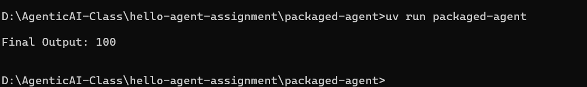

# Packaged Agent

This is a **Packaged Agent** built with [uv](https://github.com/astral-sh/uv).  
It demonstrates how to structure and run a Python package using uv.

---

## 📌 Functionality
- Prints my the sum of two numbers.

---

## ▶️ How to Run
Inside the `packaged-agent` folder:

```uv run my-packaged-agent``

## 🖼️ Output Screenshot

